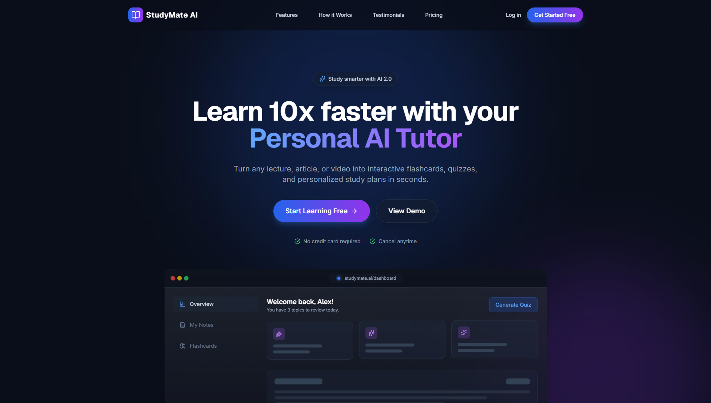
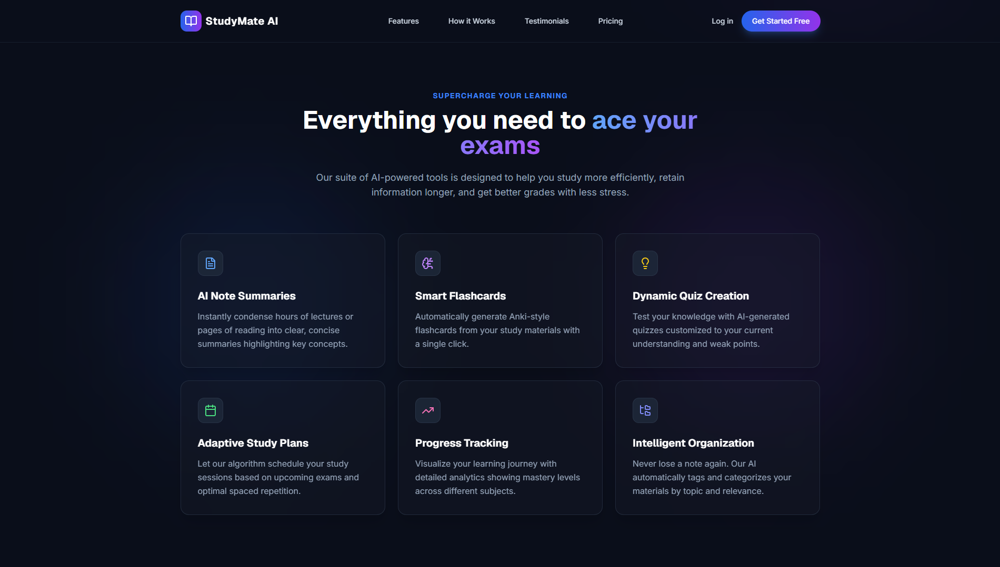
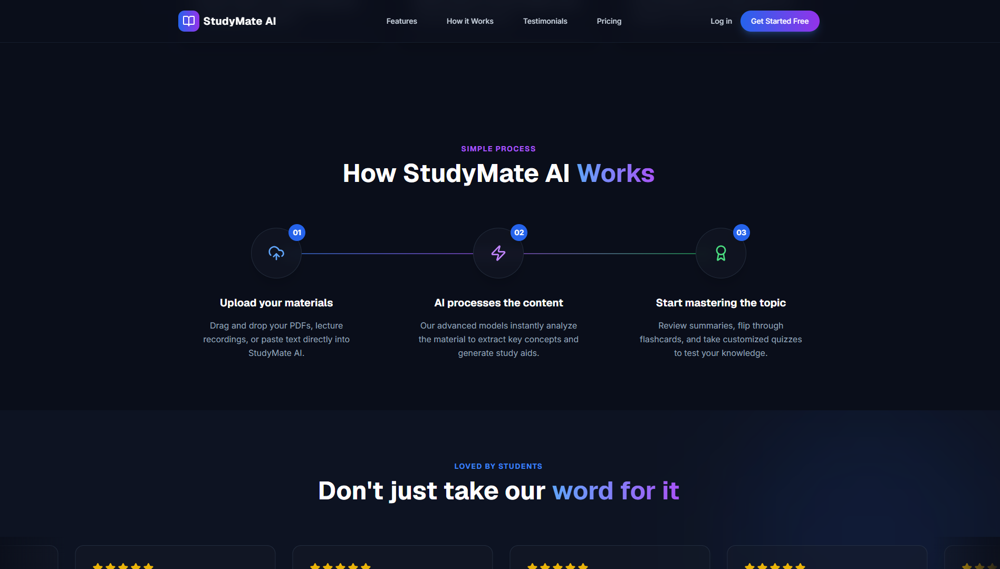
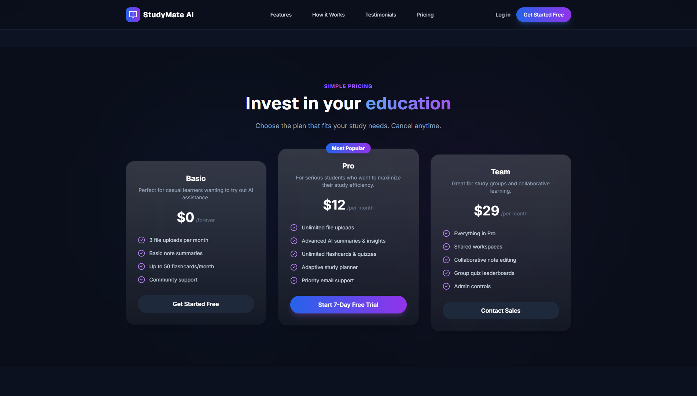

# StudyMate AI - Landing Page

An intelligent, premium marketing landing page for **StudyMate AI**—your personal learning companion designed to help you study smarter, not harder.

This project is built using a modern frontend stack with **React**, **Vite**, **Tailwind CSS**, and **Framer Motion**, matching the high-end **Luminous Intelligence** design system.

---

## 🎨 Visual Showcase

### Desktop Layouts

<p align="center">
  <strong>Hero Section & Mockup Dashboard</strong>
  <br />
  
</p>

<br />

<p align="center">
  <strong>Glassmorphic Features Grid</strong>
  <br />
  
</p>

<br />

<p align="center">
  <strong>"How It Works" Stepper</strong>
  <br />
  
</p>

<br />

<p align="center">
  <strong>SaaS Pricing Matrix</strong>
  <br />
  
</p>

### Mobile Layout

<p align="center">
  
</p>

---

## 🚀 Key Features

*   **Responsive Header & Mobile Menu**: A custom-designed navigation bar that collapses into a sleek, glassmorphic sliding menu drawer on mobile viewports.
*   **Hero Section & Mockup Dashboard**: Features key value propositions, interactive call-to-actions, and an animated product mockup with slow-drifting floating layers that simulate visual depth.
*   **Feature Overview**: A card grid detailing key functionalities (AI summaries, flashcards, scheduler, progress metrics) with interactive translation hover effects.
*   **How it Works Stepper**: A step-by-step process visualization containing custom gradient lines aligning step icons (`blue` ➔ `purple` ➔ `green`).
*   **Testimonial Marquee**: An endless horizontal scrolling testimonial marquee powered by Framer Motion.
*   **Pricing Matrix**: Tiered SaaS pricing options with highlight focus states and custom rim-light borders.
*   **Interactive FAQ**: Accordion layouts managing viewport-safe text expansion.

---

## 🎨 Design System: "Luminous Intelligence"

This project strictly adheres to the **Luminous Intelligence** design standards:

*   **Colors**: Rooted in cinematic **Midnight Navy** (`#0A0E1A` / `#0F131F`) with electric accents of violet and primary blue.
*   **Typography**: Implements **Geist** for precise, developer-centric displays and labels, and **Inter** for highly readable body copy.
*   **Glassmorphic Borders**: Implements a custom `.rim-light-border` utilizing relative bounding properties and top-down linear gradient pseudo-elements (white at 15% to 2% opacity) to simulate floating glass panels.
*   **Orbital Glows**: Soft background radial gradient blur overlays placed behind components to elevate cards off the dark layout canvas.

---

## 🛠️ Technology Stack

*   **Framework**: [React 19](https://react.dev/)
*   **Build Tool**: [Vite 8](https://vite.dev/)
*   **Styling**: [Tailwind CSS 3](https://tailwindcss.com/)
*   **Animation**: [Framer Motion 12](https://www.framer.com/motion/)
*   **Icons**: [Lucide React](https://lucide.dev/)

---

## 💻 Getting Started

### Prerequisites

*   [Node.js](https://nodejs.org/) (v18.0.0 or higher recommended)
*   [npm](https://www.npmjs.com/) (installed automatically with Node.js)

### Installation

1. Clone the repository and navigate to the directory:
   ```bash
   git clone https://github.com/dilshancode/studymate-ai.git
   cd Project01
   ```

2. Install the project dependencies:
   ```bash
   npm install
   ```

3. Run the local development server:
   ```bash
   npm run dev
   ```
   Open your browser to [http://localhost:5173/](http://localhost:5173/) to view the page.

### Build & Production Verification

To compile the production build, run:
   ```bash
   npm run build
   ```
   This generates compiled code inside the `/dist` directory.
